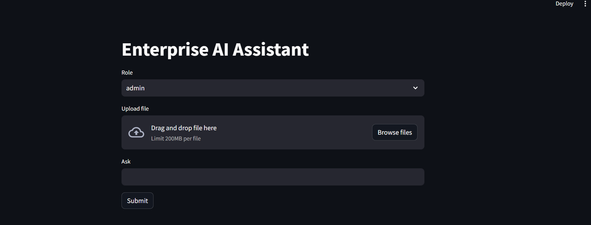
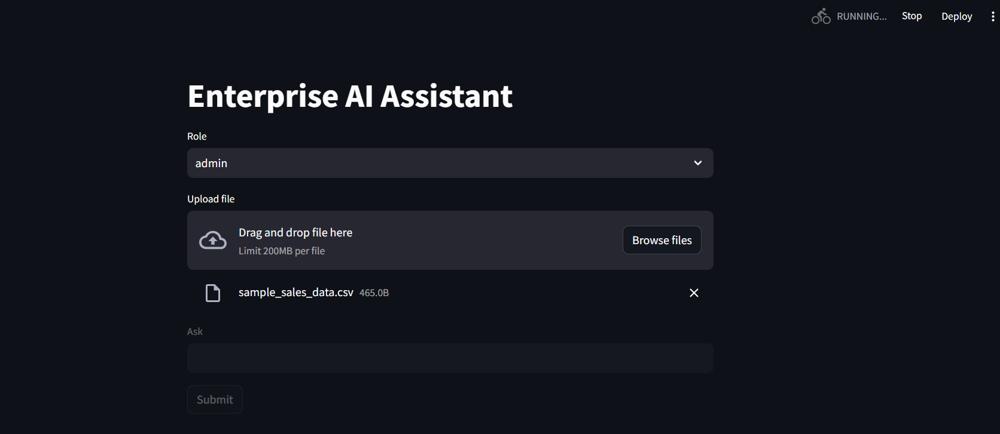
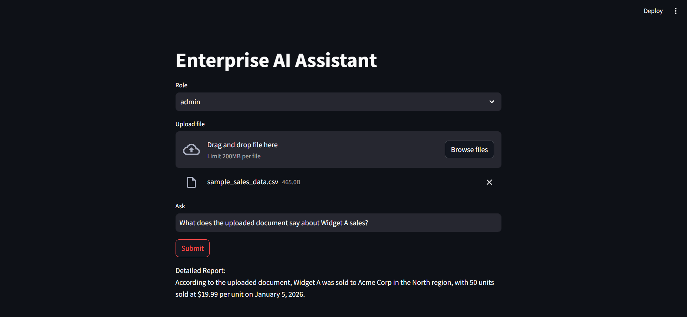
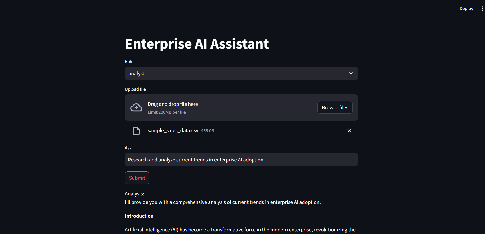
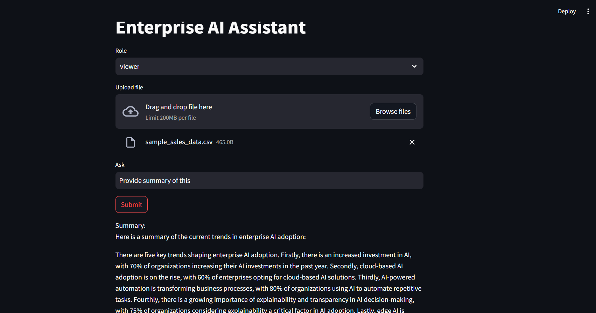

# Enterprise AI Assistant


**Repo name:** `enterprise-ai-assistant`

**Description:**
A multi-agent Retrieval-Augmented Generation (RAG) assistant for enterprise use cases. A FastAPI backend routes user queries to specialized agents — research, document retrieval (Pinecone + FAISS), SQL (natural-language-to-SQL over MySQL), and role-aware report generation - with a validation step and short-term conversational memory. A Streamlit UI provides file upload and chat. Includes two alternate multi-agent orchestration paths (AutoGen and CrewAI) alongside the primary custom `Manager` router, plus AWS Bedrock as the underlying LLM.

**Top keywords:** `multi-agent-systems` `RAG` `LLM-orchestration` `FastAPI` `AWS-Bedrock` `vector-search`

---

## Overview

This project implements an **Enterprise AI Assistant** that answers natural-language questions by routing them to the right specialist:

- **Research Agent** - deep-dive analysis via LLM
- **Retrieval Agent** — RAG over a Pinecone index, falling back to a local FAISS index
- **SQL Agent** — converts natural language to SQL and executes it against MySQL
- **Report Agent** — formats the final answer differently depending on the caller's role (`admin` / `analyst` / `viewer`)
- **Validation Agent** — a lightweight sanity check before returning a response

A simple `Memory` component keeps the last few turns of conversation so follow-up questions have context.

Two additional orchestration styles are included for comparison/experimentation:
- `autogen/` — a round-robin multi-agent group chat built with AutoGen
- `crew/` — a sequential pipeline built with CrewAI

## Architecture

```
frontend/ (Streamlit UI)
      │  HTTP
      ▼
app/  (FastAPI: main.py, auth.py, config.py)
      │
      ▼
agents/manager.py  ── routes by keyword match ──┐
      │                                          │
      ▼                                          ▼
agents/research_agent.py   agents/retrieval_agent.py   agents/sql_agent.py
      │                          │                          │
      ▼                          ▼                          ▼
core/llm.py (AWS Bedrock)   core/pinecone_db.py         database/mysql.py
                             core/faiss_db.py
                             core/embeddings.py
      │
      ▼
agents/report_agent.py → agents/validation_agent.py → core/memory.py
```

`tools/` holds file ingestion utilities (`loader.py`, `chunker.py`) used by the `/upload` endpoint, plus `mcp_tools.py` and `sql_tool.py` for tool-style access to SQL/search.

## Project Structure

```
enterprise-ai-assistant/
├── agents/
│   ├── manager.py            # Routes queries to the right agent, validates, saves memory
│   ├── research_agent.py     # LLM-based research/analysis
│   ├── retrieval_agent.py    # RAG: Pinecone → FAISS fallback
│   ├── sql_agent.py          # Runs SQL via database.mysql
│   ├── report_agent.py       # Role-based report formatting
│   ├── validation_agent.py   # Basic output validation
│   └── __init__.py
├── app/
│   ├── main.py                # FastAPI app, /upload and /query endpoints
│   ├── auth.py                # JWT auth (HTTPBearer)
│   └── config.py              # Env-based configuration
├── autogen/
│   ├── agents.py              # AutoGen assistant/specialist agent definitions
│   └── chats.py               # Chat helpers (single-agent, specialist, group chat)
├── core/
│   ├── llm.py                 # AWS Bedrock wrapper
│   ├── memory.py              # JSON-file conversation memory
│   ├── pinecone_db.py         # Pinecone vector store
│   ├── faiss_db.py            # FAISS vector store
│   └── embeddings.py          # sentence-transformers embedding model
├── crew/
│   ├── crew.py                # CrewAI agents + sequential crew
│   └── tasks.py                # CrewAI task definitions
├── database/
│   └── mysql.py                # MySQL connection + query execution
├── frontend/
│   └── app.py                  # Streamlit UI
├── tools/
│   ├── loader.py                # PDF/CSV/DOCX loaders
│   ├── chunker.py                # Text chunking for ingestion
│   ├── mcp_tools.py               # Simple action router (sql/search)
│   └── sql_tool.py                # NL-to-SQL helper with error handling
├── enterprise.sql
├── requirements.txt
├── Dockerfile
└── .env                          # Not committed — see Configuration below
```

## Tech Stack

- **Backend:** FastAPI, Uvicorn
- **Frontend:** Streamlit
- **LLM:** AWS Bedrock (via `boto3`)
- **Multi-agent frameworks:** custom router, AutoGen, CrewAI
- **Retrieval:** Pinecone (managed vector DB) + FAISS (local fallback), `sentence-transformers` embeddings
- **Database:** MySQL
- **Document processing:** `pypdf`, `python-docx`/`docx2txt`, LangChain loaders/splitters
- **Auth:** PyJWT

## Configuration

Create a `.env` file in the project root:

```env
AWS_REGION=us-east-1
BEDROCK_MODEL_ID=your-bedrock-model-id
PINECONE_API_KEY=your-pinecone-api-key
MYSQL_HOST=localhost
MYSQL_USER=your-mysql-user
MYSQL_PASSWORD=your-mysql-password
MYSQL_DB=enterprise_ai
JWT_SECRET=a-strong-random-secret
```

## How to Run

### 1. Clone and set up a virtual environment
```bash
git clone https://github.com/<your-username>/enterprise-ai-assistant.git
cd enterprise-ai-assistant
python -m venv myenv
source myenv/bin/activate   # Windows: myenv\Scripts\activate
```

### 2. Install dependencies
```bash
pip install -r requirements.txt
```

### 3. Set up the database
```bash
mysql -u root -p < enterprise.sql
```

### 4. Add environment variables
Create `.env` as shown above.

### 5. Run the backend API
```bash
uvicorn app.main:app --reload --host 0.0.0.0 --port 8000
```
The API will be available at `http://localhost:8000` (Swagger docs at `/docs`).

### 6. Run the Streamlit frontend
In a second terminal:
```bash
streamlit run frontend/app.py
```

### 7. (Optional) Run with Docker
```bash
docker build -t enterprise-ai-assistant .
docker run -p 8000:8000 --env-file .env enterprise-ai-assistant
```
Note: the current `Dockerfile` only runs the FastAPI backend; run Streamlit separately or add a second service/compose file for the frontend.

## Screenshots

**App preview**


**Document upload**


**Query results by role**

| Admin | Analyst | Viewer (Summary) |
|---|---|---|
|  |  |  |

## Testing the App

Once both the backend and Streamlit frontend are running, use the following to exercise each part of the flow.

### Sample data to upload

The `/upload` endpoint accepts `.pdf`, `.csv`, or `.docx` (see `tools/loader.py`). A small CSV is easiest to test with, e.g. a sales dataset:

```csv
order_id,customer_name,region,product,quantity,unit_price,order_date
1001,Acme Corp,North,Widget A,50,19.99,2026-01-05
1002,Beta LLC,South,Widget B,20,49.99,2026-01-12
1003,Gamma Inc,East,Widget A,75,19.99,2026-02-03
1004,Delta Co,West,Widget C,10,99.99,2026-02-15
1005,Acme Corp,North,Widget C,30,99.99,2026-03-01
1006,Epsilon Ltd,South,Widget B,40,49.99,2026-03-10
1007,Gamma Inc,East,Widget A,60,19.99,2026-03-22
1008,Beta LLC,South,Widget C,15,99.99,2026-04-02
```

> **Note:** `app/main.py` reads and chunks the uploaded file, then calls `retrieval_agent.index_documents()` to embed it into both Pinecone and FAISS, so it becomes searchable immediately for retrieval questions. Because the Streamlit frontend re-uploads the current file on every UI interaction (not just on Submit), re-uploading the same file repeatedly will index duplicate chunks over time — see Known Limitations.

### Sample questions, by routed agent

`agents/manager.py` routes each query based on keywords in the question text:

| Route | Trigger keywords | Example question |
|---|---|---|
| SQL Agent | `"database"` or `"sql"` | `database: SELECT * FROM enterprise_ai.some_table LIMIT 5` |
| Research Agent | `"research"` or `"analyze"` | `Research and analyze current trends in enterprise AI adoption` |
| Retrieval Agent (default) | anything else | `What does the uploaded document say about Widget A sales?` |

Note that `agents/sql_agent.py` passes your text straight to `database/mysql.py` as a raw query — it does not do natural-language-to-SQL conversion (that logic lives separately, unused, in `tools/sql_tool.py`). So the SQL route only works with an actual SQL statement, against a table that already exists in the `enterprise_ai` database (`enterprise.sql` only creates the empty database, no tables).

### Role switching

The **Role** dropdown (`admin` / `analyst` / `viewer`) only changes how `agents/report_agent.py` formats the same underlying answer — there's no difference in what data or agent access each role gets:

- **admin** → `Detailed Report: {data}`
- **analyst** → `Analysis: {data}`
- **viewer** → `Summary: {data}`

Try the same question across all three roles to see the prefix change.

## API Endpoints

| Method | Endpoint  | Description                              |
|--------|-----------|-------------------------------------------|
| POST   | `/upload` | Upload a PDF/CSV/DOCX file for ingestion  |
| POST   | `/query`  | Ask a question (`q`) as a given `role`    |

## Known Limitations / Roadmap

- `database/mysql.py` executes generated SQL directly without parameterization — should be sandboxed or restricted to read-only/allow-listed queries before any production use.
- `app/auth.py` has a hardcoded secret and a bare `except`; should use `JWT_SECRET` from config and narrower exception handling.
- `core/memory.py` is a single global JSON file — not concurrency-safe and not scoped per user/session.
- Query routing in `manager.py` is keyword-based; a classifier or LLM-based router would be more robust.
- AutoGen and CrewAI paths are currently independent experiments, not wired into the main FastAPI flow.
- `frontend/app.py` re-runs the `/upload` request on every Streamlit interaction (e.g. switching the Role dropdown), not just on Submit — this re-indexes the same file repeatedly, adding duplicate chunks to Pinecone/FAISS over a session. Should be gated behind a button click or a session-state check.
- RAG retrieval (`retrieval_agent.py`) returns only the top-k (3) most similar chunks per query, so questions expecting an exhaustive answer over structured/tabular data (e.g. "list every Widget A order") may miss rows that didn't score highest in similarity search. For exhaustive queries over uploaded tabular data, routing through the SQL agent against an actual imported table is more reliable than RAG.
- `core/llm.py`'s Bedrock request/response format (`max_gen_len`, `result["generation"]`) matches Meta Llama models on Bedrock specifically; pointing `BEDROCK_MODEL_ID` at a different model family (Titan, Claude, Mistral) will return a 200 response with no error but an empty generated string, since the response body won't contain a `"generation"` key.
- `app/main.py` creates the local `data/` upload directory automatically on startup (`os.makedirs("data", exist_ok=True)`) so a fresh clone doesn't fail on first upload.

## Author

**Gayathri (Mallareddygari Gayathri)**
- GitHub: [@Gayathri-Reddy874](https://github.com/Gayathri-Reddy874)
- LinkedIn: [add your LinkedIn URL here]

## License

MIT
